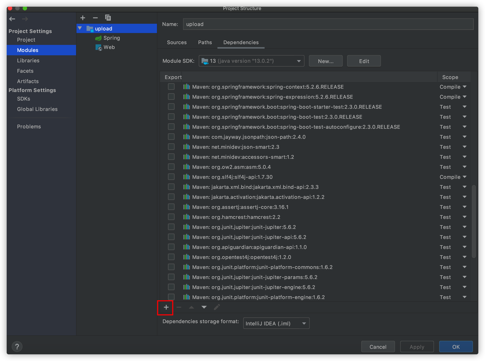
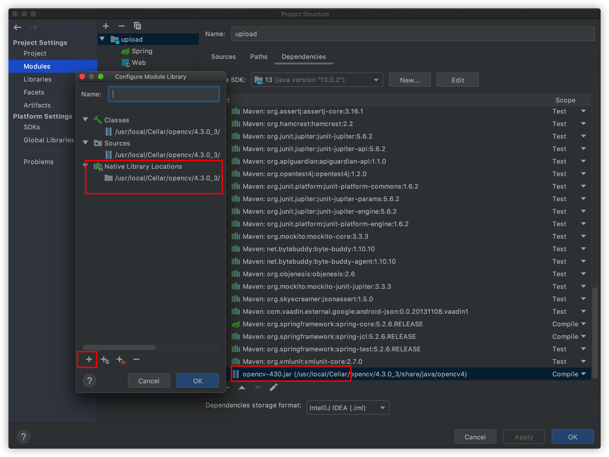

# face-recognition-toy
## Introduce
> This is a practice project for what I learning,About two months ago,Some thoughts through my mind and realized should do something I am interested in.So I choose a direction `AI` and looking for some materials.
> thanks for god,I first found a blog from network [here](https://www.cnblogs.com/subconscious/p/6240151.html). Then I begin learn from [Coursera](https://www.coursera.org/learn/machine-learning) which course 
> teach by `Andrew Ng`.After finished the course,I do it now.

## Dev environment

- Mac OS
- IntelliJ IDEA
- openjdk 13

## Settings

### Install openCV
I Use brew to install it,and it may take a few times to build.

> 1.Update your brew to latest version.
>
> 2.Enter `brew edit opencv`
>
> 3.Change `-BUILD_opencv_java=OFF` to ``-BUILD_opencv_java=ON``
>
> 4.Enter `brew install --build-from-source opencv`

### Config IDEA

1. Open `Project structure`

2. Select `Modules`

3. Click `+`  and select Jars...,and you need to choose right path where `opencv-430.jar` is and choose it.
4. Then double click the jar file as below.and you can see a pop window,then click `+` and select the native file named `libopencv_java430.dylib` that it's location same as jar file.

5. Maybe you also need to add the jar file to `Libraries`.(not sure certainly)
6. Finally,you can code like this to check whether it's all done.

```
System.loadLibrary(Core.NATIVE_LIBRARY_NAME);
Mat mat = new Mat(5, 10, CvType.CV_8UC1, new Scalar(0));
System.out.println("Open CV Mat:" + mat);
```

### Start exploring
> This project is spring boot based.So you can run it as a jar file and no more config.

1. The first thing is to execute the `db.sql` file under the resources directory.
2. After all set done,just run `com.dickie.faceRecognition.FaceRecognitionApplication` and you can use it though postman.
3. You may need to call the `readCVS2Database` interface first to initial the database.
4. The `updateModel` interface for upload/capture the images and train then.Cus the update method not supported in opencv,so every update action is actually retrain the whole database.
5. The `retrainModel` interface for train the model use data from database.
6. Finally,The `recognition` interface use to recognize the people from camera or picture.

#### More
Because of I can distinguish the left-eye and right-eye,so it is not to rotate the face.If you have an idea,Please submit an issue.
Enjoy ^v^ ...
